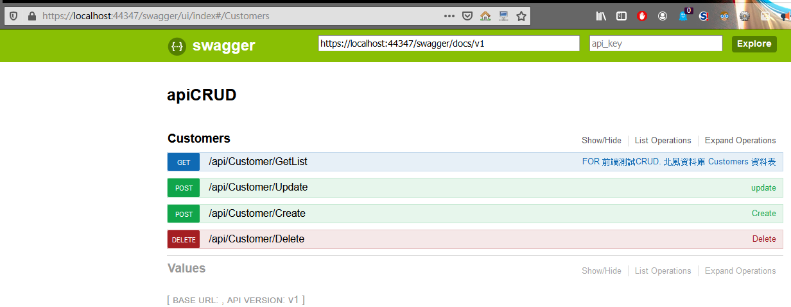
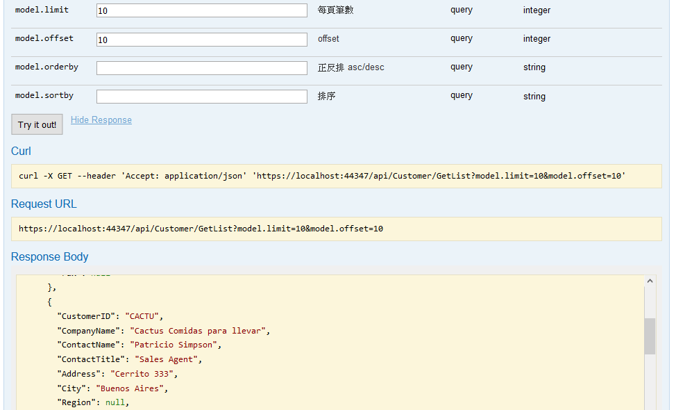
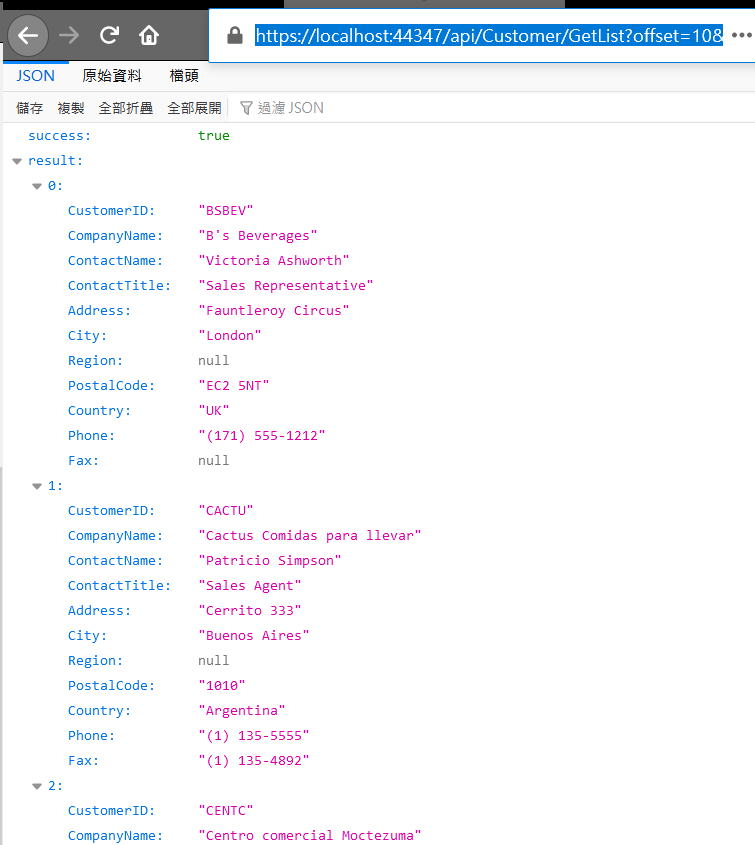

# web api CRUD

為了練習寫React 的CRUD . 寫了這個WEBAPI 

如果你不需要分頁.也可以使用其他線上的mock data,也有 WEBAPI服務

比如: [https://mockaroo.com/](https://mockaroo.com/)

這邊資料庫使用北風資料庫 Customer 資料表

使用SWAGGER 套件 ,產生說明文件.

方便用postman測試  或swagger 直接測

用chrome 測也是可以

例:[https://localhost:44347/api/Customer/GetList?offset=10&limit=10](https://localhost:44347/api/Customer/GetList?offset=10&limit=10)

## MIT License

Copyright (c) 2020
